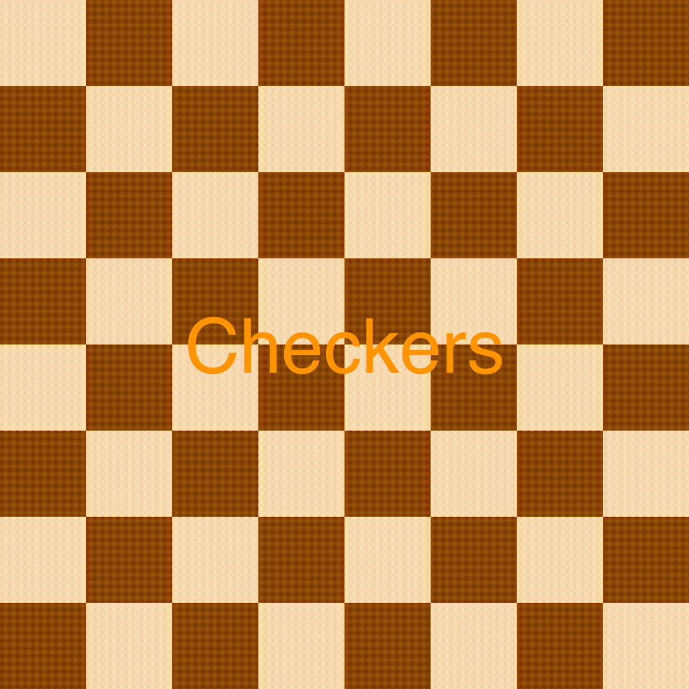
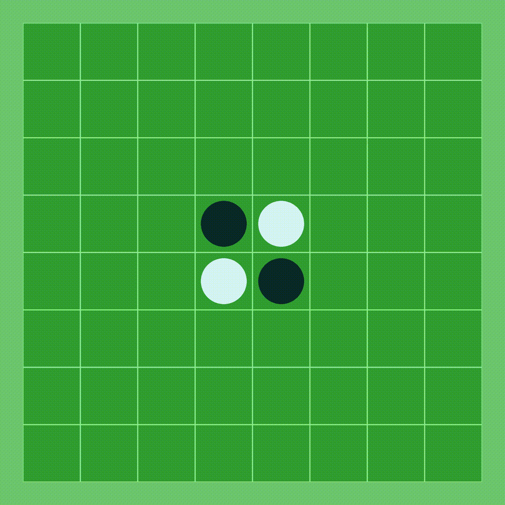
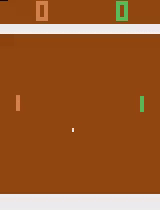
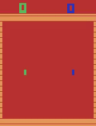
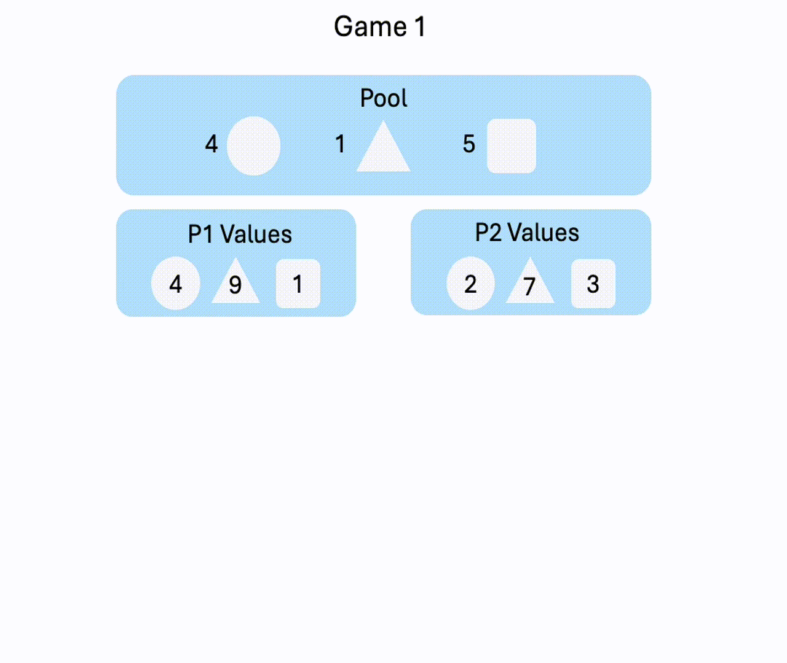
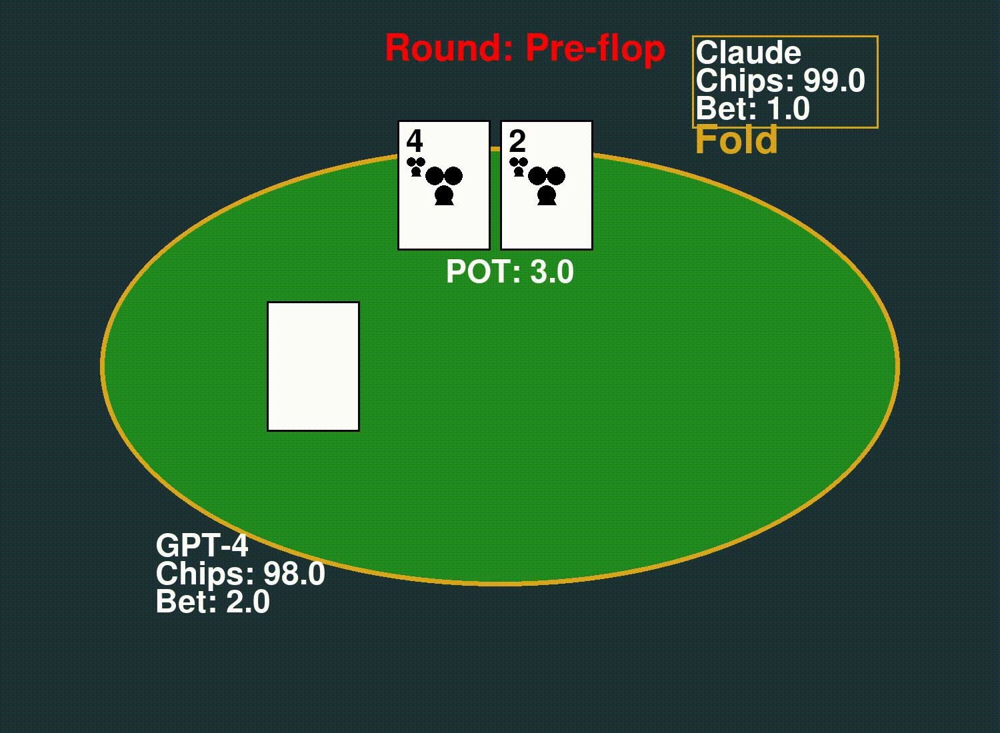

<div align="center">
  

  <h1><strong>Beyond Outcomes: Transparent Assessment of LLM Reasoning in Games</strong></h1>
  <p>
    <a href="https://arxiv.org/abs/2412.13602"><strong>Read the Paper (arXiv)</strong></a> |
    <a href="https://visual-ai.github.io/gamebot/"><strong>Visit the Project Website</strong></a>
  </p>
  <!-- Optional Badges: Add links if you have them -->
  <!-- <p>
    <a href="LICENSE"></a>
    <a href="[Link to CI/CD if you set it up]"></a>
  </p> -->
</div>

## Overview

**GAMEBoT** is a benchmark designed to evaluate the reasoning capabilities of Large Language Models (LLMs) through direct competition in a suite of diverse games. Going beyond simple win/loss outcomes, GAMEBoT facilitates a more transparent assessment by enabling analysis of the intermediate reasoning steps and strategies employed by LLMs during gameplay. 

Advantages of using GAMEBoT include:
* **Interpretability**: Assessments on final decisions and also the intermediate steps.
* **Difficulty**: Challenging enough to differentiate between top-performing models.
* **Hard to be cheated**: Interactive gaming environments alleviate data contamination concerns.
* **Stronger Baselines**: The prompts presented can serve as valuable CoT baselines for future research.

## Key Features

* **Focus on Reasoning:** Evaluates not just game outcomes but the quality of strategic thinking.
*   **Transparent Evaluation:** Provides game logs and visualizations for detailed analysis.
*   **Extensible Framework:** Easily add new LLM agents.
* **Diverse Game Suite:** Includes 8 games covering different reasoning aspects (e.g., strategy, logic, spatial awareness).
<!-- HTML Table for GIF Grid - 4 columns, 2 rows -->
<table>
  <tr>
    <td align="center">
      <!-- Replace with your actual GIF path/URL -->
      
      <br /><sub><b>Checkers</b></sub>
    </td>
    <td align="center">
      <!-- Replace with your actual GIF path/URL -->
      
      <br /><sub><b>TicTacToe</b></sub>
    </td>
    <td align="center">
      <!-- Replace with your actual GIF path/URL -->
      
      <br /><sub><b>Connect4</b></sub>
    </td>
    <td align="center">
      <!-- Replace with your actual GIF path/URL -->
      
      <br /><sub><b>Othello</b></sub>
    </td>
  </tr>
  <tr>
    <td align="center">
      <!-- Replace with your actual GIF path/URL -->
      
      <br /><sub><b>Pong</b></sub>
    </td>
    <td align="center">
      <!-- Replace with your actual GIF path/URL -->
      
      <br /><sub><b>Surround</b></sub>
    </td>
    <td align="center">
      <!-- Replace with your actual GIF path/URL -->
      
      <br /><sub><b>Negotiate</b></sub>
    </td>
    <td align="center">
      <!-- Replace with your actual GIF path/URL -->
      
      <br /><sub><b>Texas Hold'em</b></sub>
    </td>
  </tr>
</table>
<!-- End of HTML Table for GIFs -->


## Latest Updates (March 2025)

**O3-mini-high dominates GAMEBoT!** Our latest evaluations show O3-mini-high outperforming top competitors including DeepSeek-R1 and Claude 3.7 Sonnet.

### Connect4 Matches
| Model A                   | Score  | Model B                   |
|---------------------------|--------|---------------------------|
| gemini-2.0-flash-thinking | 6 : 4  | gpt-4o-0513               |
| gemini-2.0-pro-exp        | 6 : 4  | gemini-2.0-flash-thinking |
| deepseek-r1               | 7 : 3  | gemini-2.0-pro-exp        |
| deepseek-r1               | 8 : 8  | o1-preview                |
| o3-mini-high              | 10 : 6 | deepseek-r1               |
| o3-mini-high              | 8 : 8  | claude-3.7-sonnet         |
| o3-mini-high              | 12 : 4 | gpt-4.5                   |

### Checkers Matches
| Model A            | Score | Model B                   |
|--------------------|-------|---------------------------|
| gemini-2.0-pro-exp | 5 : 4 | gemini-2.0-flash-thinking |
| deepseek-r1        | 9 : 1 | gemini-2.0-pro-exp        |
| o3-mini-high       | 9 : 0 | deepseek-r1               |
| o3-mini-high       | 9 : 0 | claude-3.7-sonnet         |


## Evaluated Models

### Models Evaluated in the Paper

| Provider   | Model Name                       | API/Identifier                     |
| :--------- | :------------------------------- | :--------------------------------- |
| OpenAI     | GPT-4o                           | `gpt-4o-2024-05-13`                |
| OpenAI     | GPT-4o mini                      | `gpt-4o-mini-2024-07-18`           |
| OpenAI     | GPT-4 Turbo                      | `gpt-4-1106`                       |
| Google     | Gemini 1.5 Pro                   | `gemini-1.5-pro-preview-0514`      |
| Google     | Gemini 1.5 Flash                 | `gemini-1.5-flash-preview-0514`    |
| Google     | Gemini 1.0 Pro                   | `gemini-1.0-pro-002`               |
| Anthropic  | Claude 3 Haiku                   | `claude-3-haiku@20240307`          |
| Anthropic  | Claude 3 Sonnet                  | `claude-3-sonnet@20240229`         |
| Anthropic  | Claude 3.5 Sonnet                | `claude-3-5-sonnet@20240620`       |
| Meta       | Llama 3 8B Instruct (via Maas)   | `meta/LLaMA3-8b-instruct-maas`     |
| Meta       | Llama 3 70B Instruct (via Maas)  | `meta/LLaMA3-70b-instruct-maas`    |
| Meta       | Llama 3 405B Instruct (via Maas) | `meta/LLaMA3-405b-instruct-maas`   |
| Reka       | Reka Flash                       | `reka-flash-20240904`              |
| Reka       | Reka Core                        | `reka-core-20240415`               |
| AI21 Labs  | Jamba 1.5 Large                  | `jamba-1.5-large`                  |
| AI21 Labs  | Jamba 1.5 Mini                   | `jamba-1.5-mini`                   |
| Mistral AI | Mistral Nemo                     | `mistral-nemo-2407`                |

### Newly Supported Models

| Provider   | Model Name                         | API/Identifier                        |
| :--------- | :--------------------------------- | :------------------------------------ |
| Google     | Gemini 2.0 Flash Exp               | `gemini-2.0-flash-exp`                |
| Google     | Gemini 2.0 Flash Thinking Exp      | `gemini-2.0-flash-thinking-exp-01-21` |
| Google     | Gemini 2.0 Pro Exp                 | `gemini-2.0-pro-exp-02-05`            |
| Anthropic  | Claude 3.5 Sonnet v2               | `claude-3-5-sonnet-v2@20241022`       |
| Anthropic  | Claude 3.5 Haiku                   | `claude-3-5-haiku@20241022`           |
| DeepSeek   | DeepSeek R1                        | `deepseek-r1`                         |
| OpenAI     | o1                                 | `o1-2024-12-17`                       |
| OpenAI     | o1 mini                            | `o1-mini-2024-09-12`                  |
| OpenAI     | o3 mini                            | `o3-mini`                             |


## Installation

1. **Prerequisites:**
    *   Python 3.10
    *   `git`

2. **Clone Repository:**
    ```bash
    git clone https://github.com/Visual-AI/GAMEBoT.git
    cd GAMEBoT
    ```

3. **Set up Environment (Recommended):**
    *   **Using `venv`:**
        ```bash
        python -m venv venv
        source venv/bin/activate  # On Windows use `venv\Scripts\activate`
        ```
    *   **Using `conda`:**
        ```bash
        conda create -n gamebot python=3.10
        conda activate gamebot
        ```

4. **Install Dependencies:**
    ```bash
    sh setup_env.sh && pip install -r requirements.txt
    ```

5. **Configure LLM API**
    * Setup your API keys in `keys.py`.
   
## Adding New LLM Agents
Most of the provided LLMs are from Google Vertex Cloud. You might need to add your own API access or new models:

1. **Implement the Agent Interface:** Create a new class for your agent within the `agent_list/` directory. The class should implement the following method: 
      ```
          def get_response_text(self, prompt):
                # Your code to get the response from the LLM
                return response_text
      ```
   See `agent_list/DeepSeek_ByteDance` class as an example.

3. **Handle API Keys/Credentials:** Ensure your new agent class can access necessary credentials.
4. **Register the Agent:** Add your new agent class and its identifier string to the `InitAgent()` function in `agent_list/__init__.py`. The code is written to be extensible, and this makes the identifier (e.g., `'my-custom-model'`) directly usable in the command line for `run_games_and_check/` scripts.

## Running the Benchmark


1. **Execution Command:**
    The general format for running a game between two LLMs is:
    ```bash
    python run_games_and_check/<game_script_name>.py <agent1_identifier> <agent2_identifier> [--cycles N] [other_game_specific_args]
    ```
    *   `<game_script_name>.py`: The script for the specific game (e.g., `connect4.py`).
    *   `<agent1_identifier>`: The identifier for the first player's LLM (e.g., `gpt-4o`, `gemini-1.5-pro-preview-0514`). Use the identifiers listed in the tables above or the ones you add.
    *   `<agent2_identifier>`: The identifier for the second player's LLM.
    *   `--cycles N`: (Optional) Specifies the number of games to play between the two agents.

2. **Example (Connect 4):**
    Run one game of Connect 4 between GPT-4o and the experimental Gemini 2.0 Flash Thinking model:
    ```bash
    python run_games_and_check/connect4.py gpt-4o gemini-2.0-flash-thinking-exp-01-21 --cycles 1
    ```

## Visualization
**Visualize Game Logs:**
*   After running a game, you can visualize the game logs using the provided visualization script:
    ```bash
    python visualizer/{game_visualizer}.py <game_log_file>
    ```
    Replace `<game_log_file>` with the path to the log file generated during gameplay.

## Contributing

We welcome contributions! If you'd like to add new games, agents, or features, please feel free to open an issue or submit a pull request. 
We can also help benchmark your trained model. Email to: [linius@connect.hku.hk](mailto:linius@connect.hku.hk)


## Citing GAMEBoT

If you find GAMEBoT useful in your research, please cite our paper:

```bibtex
@article{lin2024beyond,
  title={Beyond Outcomes: Transparent Assessment of LLM Reasoning in Games},
  author={Lin Wenye and Roberts Jonathan and Yang Yunhan and Albanie Samuel and Lu Zongqing and Han Kai},
  journal={arXiv preprint arXiv:2412.13602},
  year={2024}
}